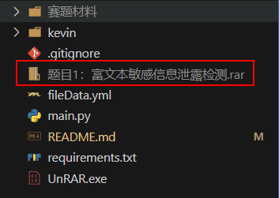

# huaweicup2-RichTextDetc
## 华为杯富文本敏感信息泄露检测

-----

[官网地址](https://cpipc.acge.org.cn//cw/detail/2c90800c8093eef401809d33b36f0652/2c90801787f062ab0188719bbb3a7891)   

[附件下载地址](https://cpipc.acge.org.cn//cw/list/2c90800c8093eef401809d33b36f0652/%E8%B5%9B%E4%BA%8B%E5%8A%A8%E6%80%81/1/1)

### 赛题内容

**背景：**

在攻防演练中，蓝队通常会在拿到目标服务器文件浏览权限后，进一步收集诸如用户名密码等敏感信息，方便后续进一步渗透测试。现需要设计一个程序，能够在目标服务器上运行，对目标服务器中的海量文件进行扫描，检测其中是否含有潜在的敏感信息泄露。

**竞赛题目描述：**

给定一个包含大量文件的压缩包（见附件），选手需要编写程序，自动化提取其中敏感的认证信息。压缩包中的文件格式包含但不仅限于Word、Excel、PowerPoint、txt、各类系统配置文件、图片、聊天纪录等。

**考察内容：**

1、提取敏感认证信息，包含但不仅限于目标地址、端口、用户名、密码、密码hash、Token、AK/SK等。

2、程序应能关联上下文，输出关联的敏感信息对，如`{"ip":"127.0.0.1","port":3306,"username":"root","password":"root"}`

**评价方式：**

1、提取的敏感内容条目不少于预设总条目的80%

2、提取条目相同时，时间越少越好。

## 运行

---

将赛题压缩包放到根目录下

`pip install -r requirements.txt  `下载依赖

运行`main.py`