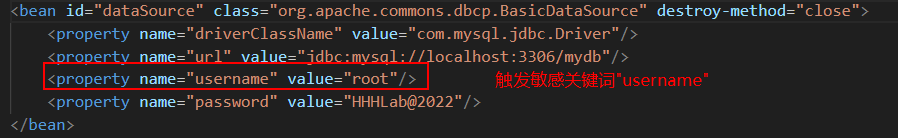
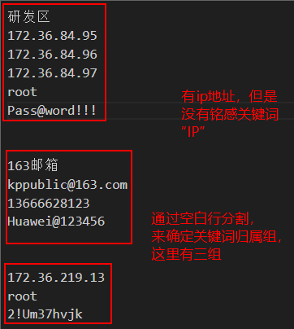
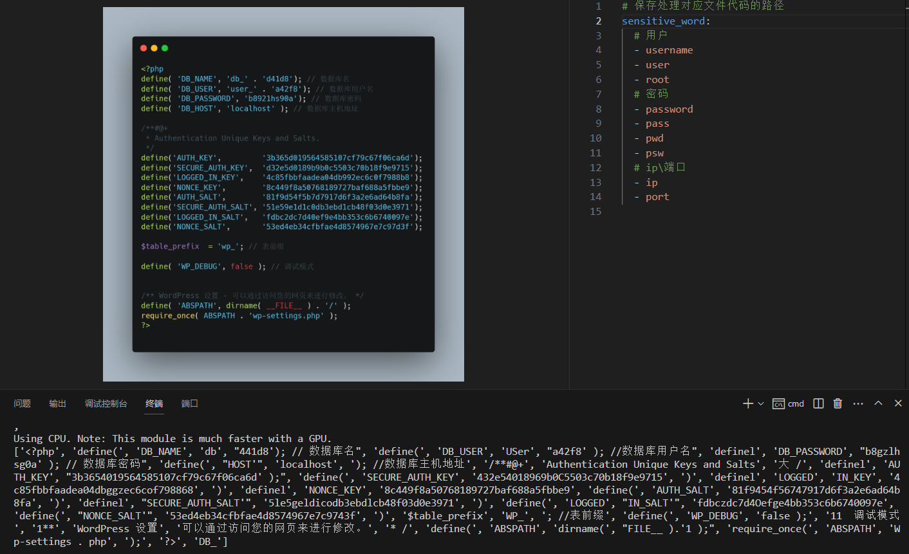

# note

## 一、文件读取

对于压缩包里面的目标文件，首先分文件类型(按照文件后缀)读取

## 二、敏感信息

在分析文件之后，清洗数据（重复数据过滤？），找到对应`敏感认证信息`

> 铭感词检测：
>
> > https://ai.baidu.com/tech/textcensoring
> >
> > https://dun.163.com/search/5pWP5oSf6K-N6L-H5rukIGdpdGh1Yg

### 1.敏感词提取

> - **预设敏感关键词，如果文件内容触发关键词，则提取出来**
>
>   > 例如：
>   >
>   > **预设有铭感关键词：username**
>   >
>   > 
>   >
>   > 
>
> - **如果没有触发敏感关键词，但是由具有敏感信息，那么按照分隔符(换行符、空格、空白行等来提取信息)**
>
>   > 


### 2.图片提取



> - [x] 问题：路径不能包含中文，不知道怎么搞(路径转换为numpy格式)


## 三、上下文关联

如何对铭感信息上下文关联？可以参考LLM上下文关联

## 四、最终程序

①是一个可执行可安装程序

> [py程序打包可执行文件](https://www.jianshu.com/p/825397df4aa0)
>
> [python打包](https://www.zhihu.com/tardis/zm/art/162237978?source_id=1003)

②有简单的图形界面，可交互

> 用户选择文件位置——可以是压缩文件，也可以是文件夹

③拖入文件即可自动解析，并且输出分析结果


# 其他

本地创建环境：

- python=3.9.17


**每次开发流程：**

- 拉项目
- 下`requireents.txt`依赖
- 写代码
- 更新依赖`pip freeze > ./requirements.txt`
- 上传代码

## 项目依赖

将所有依赖添加进`requirements.txt`，使用命令：

```shell
pip freeze > ./requirements.txt
```

> 参考：https://www.jianshu.com/p/acb3205aea54